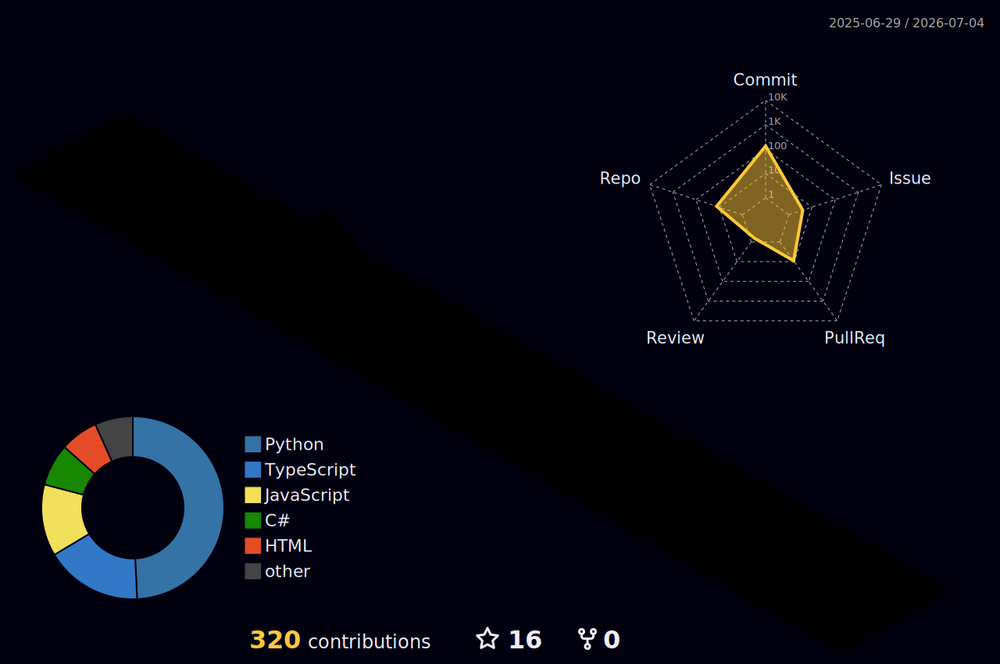

---

## Hey, I'm Wesley ·͜· 

Machine Learning Engineer and Systems Engineering student at UNI (Nicaragua).  
I build end-to-end ML pipelines, AI-augmented automation systems, and data engineering workflows — with a focus on regulated and financial environments.

My work sits at the intersection of **ML**, **intelligent automation**, and **backend engineering**.

---

## ♟️ Play Community Chess With Me

This board is **playable by anyone**. Click a link under **TO** and it opens a pre-filled GitHub issue — just submit it. A GitHub Action validates the move, updates the board and commits it. White moves first, and you can't move twice in a row.

> No game in progress yet — [**♟️ Start a new game**](https://github.com/wesleyruiz2005/wesleyruiz2005/issues/new?title=Chess%3A+Start+new+game&body=Please+do+not+change+the+title.+Just+click+%22Submit+new+issue%22.+You+don%27t+need+to+do+anything+else+%3AD) to begin!

It's <!-- BEGIN TURN -->white(clear)<!-- END TURN --> turn.

<!-- BEGIN CHESS BOARD -->
|   | A | B | C | D | E | F | G | H |   |
|---|:-:|:-:|:-:|:-:|:-:|:-:|:-:|:-:|:-:|
| **8** |  |  |  |  |  |  |  |  | **8** |
| **7** |  |  |  |  |  |  |  |  | **7** |
| **6** |  |  |  |  |  |  |  |  | **6** |
| **5** |  |  |  |  |  |  |  |  | **5** |
| **4** |  |  |  |  |  |  |  |  | **4** |
| **3** |  |  |  |  |  |  |  |  | **3** |
| **2** |  |  |  |  |  |  |  |  | **2** |
| **1** |  |  |  |  |  |  |  |  | **1** |
|   | **A** | **B** | **C** | **D** | **E** | **F** | **G** | **H** |   |
<!-- END CHESS BOARD -->

**▸ Your move** (appears once a game starts)

<!-- BEGIN MOVES LIST -->
[**♟️ Start a new game**](https://github.com/wesleyruiz2005/wesleyruiz2005/issues/new?title=Chess%3A+Start+new+game&body=Please+do+not+change+the+title.+Just+click+%22Submit+new+issue%22.+You+don%27t+need+to+do+anything+else+%3AD) to get the list of available moves.
<!-- END MOVES LIST -->

<b>▸ Recent moves & top players</b>

<!-- BEGIN LAST MOVES -->
| Move | Author |
| :--: | :----- |
<!-- END LAST MOVES -->

<!-- BEGIN TOP MOVES -->
| Total moves |  User  |
| :---------: | :----- |
<!-- END TOP MOVES -->

---

## ◈ Currently working on

- Binary classification pipelines for credit default risk — feature engineering, LightGBM, AUC-ROC optimization
- ELT pipelines with multi-source ingestion (REST APIs, CSV) into SQLite data warehouses; pandas/SQL transformation layers
- NLP and MLOps projects — model versioning, reproducible workflows, evaluation pipelines
- AI-augmented RPA automation in production financial environments — UiPath REFramework + AI Activities
- AI agent orchestration with n8n — LLM nodes, webhook triggers, cross-system integration

---

## ⌘ Tech Stack

**▸ AI & Machine Learning**

**▸ Automation & AI Agents**

**▸ Data & Backend**

**▸ DevOps & MLOps**

---

## ◉ Activity

  📖 <a href="https://arxiv.org/abs/1706.03762">Attention Is All You Need</a>

  

---

  

---

## ◷ Activity Graph

---

## ⌁ Contribution Snake

  

---

## ⊞ Stats

  

---

## ✦ Streak

  

---

## ⌨ Dev Humor

  

---

## ♫ Now Playing on Spotify

  

---

## ◳ Skills & Tools

  

---

## ◰ Detailed Stats

  
  

  
  

---

## ⟁ LeetCode

  

---

## ◱ 3D Contribution Calendar

  

---

## ◲ Metrics

  

---

  
  
  

